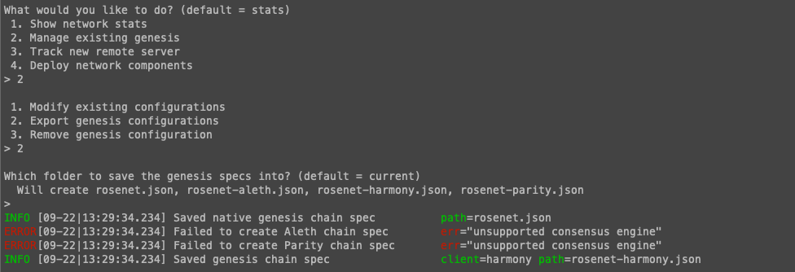

# PoA Blockchain (Unsuccessful)
----
In this assignment we were challenged with creating our own private Proof of Authority blockchain with Geth. PoA blockchains are generally only used for private blockchains because they require the node (sealer) addresses that can mine blocks to be pre-approved on creation of the genesis block. The largest blockchain that uses PoA is XRP (Ripple). It is is widely considered not to be decentralised enough.


## Creating the nodes
----
Open a terminal window and navigate to the 'geth' folder
 ```
* ./geth --datadir node1 account new 
```
 ```
* ./geth --datadir node2 account new 
```

Making sure to save the node keys and passwords

## Creating the genesis block
----
Using that same terminal window run:
```
./puppeth
```

- Blockchain name: rosenet
- Input the node addresses as the sealer addresses
- Pre-fund both nodes
- Chain ID: 5678

- Export genesis configurations as 'rosenet.json'

## Initialising the nodes
----
- Initialise both nodes using 'rosenet.json'

----
### Unsuccessful
----

Originally I had the nodes up and mining and had created a custom node on MyCrypto, but when I tried to send transactions I got the error 'Invalid sender'.

On this particular run through, this was as far as I could get. I have now been getting the error: `Fatal: Failed to unlock account ea3714765aa3ef69889ecc23ded10896e9e6ce57 (no key for given address or file)`. I spent many hours and tried many different combinations of network names, chain ID's and sending transactions from different nodes. I spent hours with two seperate helpers from askBCS and both gave up in the end.

